# Agent 架构体系与 RAG 召回思路(面试准备指南)

> 本文图片全部内嵌于 `docs/images/` 目录,离线可用。
> 主要参考:Anthropic《Building Effective Agents》、Lilian Weng《LLM Powered Autonomous Agents》、ReAct / Reflexion / RAG Survey / CRAG / RAPTOR / GraphRAG 等论文,文末附完整来源列表。

---

# 第一部分:Agent 架构体系

## 0. 总览:Agent = LLM + Planning + Memory + Tool Use

Lilian Weng 的经典定义:一个自主的 Agent 由四大模块组成,LLM 是大脑,负责推理和决策。


*来源:[Lilian Weng - LLM Powered Autonomous Agents](https://lilianweng.github.io/posts/2023-06-23-agent/)*

| 模块 | 作用 | 常见实现 |
|---|---|---|
| **Planning** | 任务分解、反思与自我修正 | CoT、ToT、ReAct、Reflexion |
| **Memory** | 短期(上下文)与长期(外部存储) | 上下文窗口、向量库、文件系统 |
| **Tool Use** | 调用外部工具扩展能力边界 | Function Calling、MCP、代码执行 |
| **LLM 核心** | 理解、推理、决策 | GPT/Claude/Gemini 等 |

**理解主线**:所有 Agent 架构的差异,本质上就是**自主性高低**和**决策粒度**的不同。自主性越高越灵活,但越难控制、成本越高。面试中能讲清这个取舍,比背架构名字更重要。

```
自主性递增:Workflow → Router → ReAct → Plan-and-Execute → Reflexion → 自主循环 → Multi-Agent
            └────────── 可控、确定性强 ──────────┘└────────── 灵活、成本高 ──────────┘
```

---

## 1. 底座:Tool Use / Function Calling

一切 Agent 的基础设施。LLM 不直接执行工具,而是**输出结构化的调用意图**,由外部执行器执行后,把结果回填上下文,循环往复。

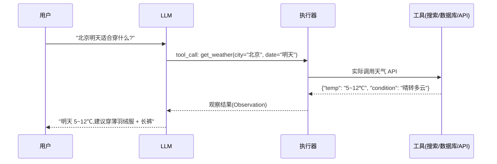

**关键点**:
- LLM 只负责"决定调用什么、传什么参数",**执行永远在外部**,这样才能控制权限、超时、重试。
- 工具定义(schema)本质是 prompt 工程的一部分,Anthropic 发现 SWE-bench 上**花在工具定义上的时间比 prompt 本身还多**。
- 现代模型(如 Claude)单轮可以并行输出多个 tool call,大幅减少往返。

**面试考点**:tool call 失败了怎么办?(参数校验、错误信息回填让模型自纠、poka-yoke 防呆设计——比如强制绝对路径)

---

## 2. Workflow 五种模式(Anthropic 分类)

Anthropic 的定义(面试常考):**Workflows 是 LLM 和工具通过预定义代码路径编排的系统;Agents 是 LLM 动态决定自己流程和工具使用的系统。** 能用 workflow 解决的,不要上 agent。

### 2.1 基础构件:增强型 LLM(Augmented LLM)

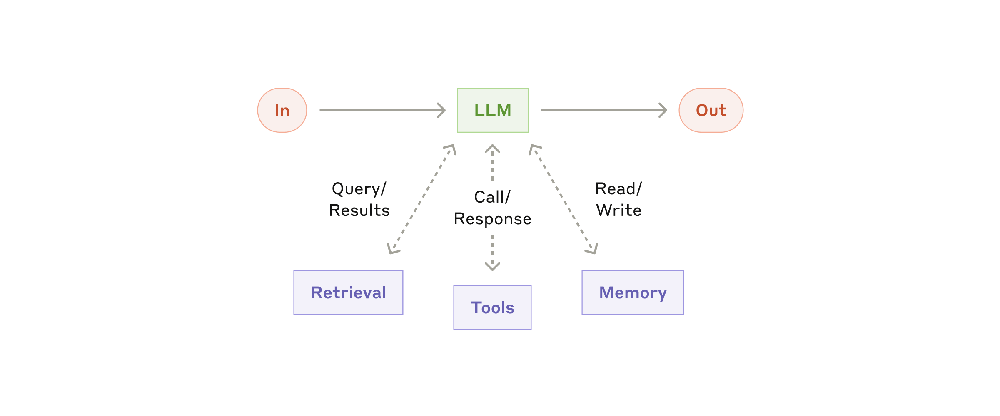
*来源:[Anthropic - Building Effective Agents](https://www.anthropic.com/research/building-effective-agents)*

LLM + 检索 + 工具 + 记忆,是一切上层模式的积木。

### 2.2 Prompt Chaining(提示链)

把任务分解成**固定顺序**的子步骤,每步 LLM 调用处理上一步的输出,中间可插入程序化的检查点(gate)。


**例子**:
- 营销场景:先生成产品文案 → 再翻译成英文 → 再按品牌规范润色。每步只做一件事,比一次性"生成+翻译+润色"准确率高得多。
- 写作文档:先生成大纲 → 程序检查大纲是否覆盖必需章节(gate)→ 通过后按大纲写正文。

**适用**:任务能干净地拆成固定子步骤,愿意用延迟换准确率。

### 2.3 Routing(路由)

先对输入分类,再分发到不同的下游 prompt / 模型 / 工具。核心价值是**关注点分离**——不同类型的输入用各自优化的专用 prompt,避免一个 prompt 什么都管、什么都管不好。


**例子**:
- 客服系统:用户消息先分类 → 一般咨询走 FAQ 流程、退款请求走带"查询订单 API"的流程、技术支持走带知识库检索的流程。
- 成本优化:简单问题路由给小模型(如 Haiku),困难问题路由给大模型(如 Sonnet),这是生产中最常用的省钱手段。

**面试考点**:路由器本身就是一个分类任务,如果分类错了怎么办?(置信度阈值兜底、fallback 分支、埋点监控分类准确率)

### 2.4 Parallelization(并行化)

两种变体:
- **Sectioning(分片)**:任务拆成独立的子任务并行跑,程序聚合结果。
- **Voting(投票)**:同一个任务跑多次(不同 prompt/不同视角),投票取结果。


**例子**:
- Sectioning:内容审核——一个 LLM 实例正常回复用户,另一个实例并行做敏感内容审查,比单实例既回复又审查更准。
- Voting:代码漏洞审查——3 个不同视角的 prompt(安全、性能、规范)分别审同一份代码,各自标记问题后合并。

**适用**:子任务天然独立、追求速度;或需要多视角提升置信度。

### 2.5 Orchestrator-Workers(编排者-工人)

与并行化的区别:**子任务不是预定义的,由中心 LLM 根据输入动态拆解和分派**。


**例子**:
- 代码 Agent 改一个需求:中心 LLM 先分析要改哪些文件(每次任务都不一样),然后为每个文件的修改分派 worker,最后合成。
- 深度调研产品:中心 LLM 决定从哪几个维度搜索、每个 worker 负责一个维度,最后汇总成报告。

这是 Anthropic 认为在**编码产品**中最实用的模式之一(Cursor、Claude Code 类产品的雏形)。

### 2.6 Evaluator-Optimizer(评估者-优化者)

一个 LLM 生成回答,另一个 LLM 评估并给反馈,循环打磨。类似人类作者的"写作-修改"循环。


**例子**:
- 文学翻译:翻译模型初翻 → 评估模型指出"这处双关语没翻出来、语气太正式" → 翻译模型修改,循环。
- 复杂搜索:评估者判断"信息还不够全面" → 触发新一轮搜索,直到满足标准。

**适用**:有清晰的评估标准、且迭代确实能带来可度量的提升。**前提是 LLM 能给出有效的反馈**——如果它自己都判断不了好坏,这个循环就是空转烧钱。

### 2.7 Agent(自主智能体)

Anthropic 的经典论断:**Agent 就是"LLM 基于环境反馈在循环中使用工具"**,实现往往出奇地简单,难在工具设计和停止条件。

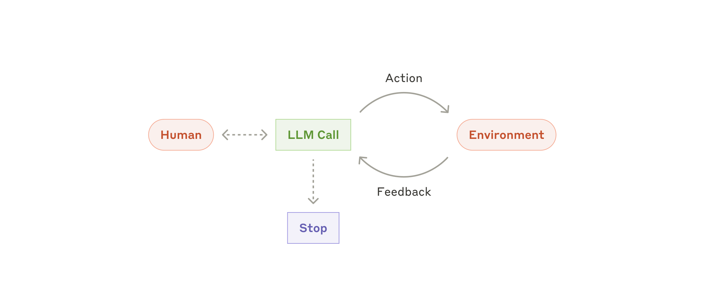


**例子**:
- Anthropic 的 SWE-bench Agent:读 GitHub issue → 搜索代码库 → 改多个文件 → 跑测试 → 根据测试结果修复,直到解决。
- Computer Use:Claude 直接看屏幕截图、移动鼠标、点击操作电脑完成任务。

**关键设计点**:
- **停止条件**:任务完成 + 最大迭代数上限,防止失控烧钱。
- **Ground Truth**:每一步从环境拿真实反馈(工具结果、代码执行结果)来校准,而不是让模型自己猜。
- **人工介入点**:遇到阻塞或关键决策时暂停。

**面试考点**:为什么 Anthropic 说"Agent 往往只是 LLM 用工具的循环,但要花大量时间优化工具定义"?→ ACI(Agent-Computer Interface)类比 HCI,工具的参数设计、错误信息、文档质量直接决定 agent 的成功率。

---

## 3. ReAct(Reasoning + Acting)

最经典的 Agent 推理框架。核心:**交替生成推理轨迹(Thought)和动作(Action),每个动作的观察结果(Observation)加入上下文,指导下一步推理**。

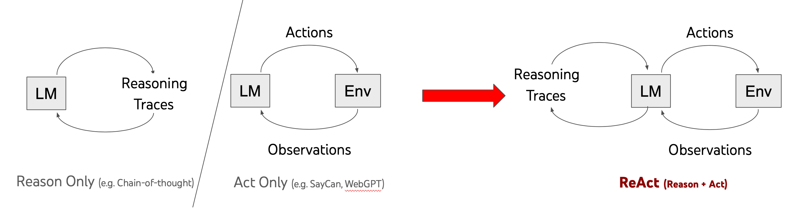
*来源:[ReAct: Synergizing Reasoning and Acting in Language Models](https://react-lm.github.io/)(Yao et al., 2022)*

**例子**(HotpotQA 多跳问答,ReAct 论文原例):

```
Question: Were Scott Derrickson and Ed Wood of the same nationality?

Thought 1: 我需要搜索 Scott Derrickson 和 Ed Wood,比较他们的国籍。
Action 1: Search[Scott Derrickson]
Observation 1: Scott Derrickson 是美国电影导演、编剧……
Thought 2: 他是美国人。接下来查 Ed Wood。
Action 2: Search[Ed Wood]
Observation 2: Edward Davis Wood Jr. 是美国电影导演、制片人……
Thought 3: Ed Wood 也是美国人,所以两人国籍相同。
Action 3: Finish[Yes]
```

**为什么有效**:
- 比纯 CoT 多了**外部观察**,能纠正推理中的事实错误(幻觉)。
- 比纯 Acting(无思考)多了**显式推理**,复杂任务规划更好。

**缺点**:
- **单步规划**:每步只看到眼前,容易陷入局部,长任务错误累积。
- **循环失控**:Observed 结果误导时可能原地打转,需要步数上限。
- 上下文随步数线性增长,token 成本高。

**面试考点**:ReAct vs Plan-and-Execute 的取舍(见下节);如何检测和打断循环。

---

## 4. Plan-and-Execute(先规划后执行)

针对 ReAct 单步规划的缺陷:**先让 LLM 生成完整计划,再逐步执行,执行中可按需 replan**。

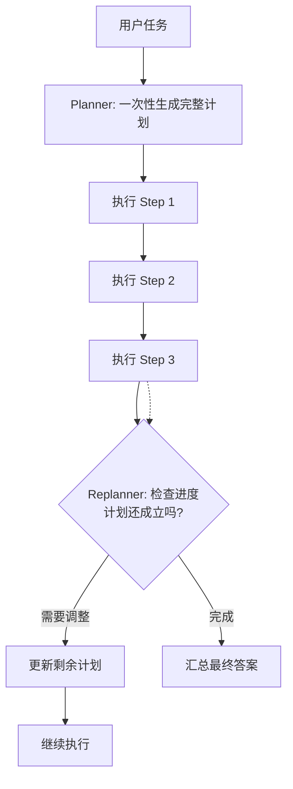

**例子**(代码任务):
- 任务:"给这个项目加上用户登录功能"
- 计划:①分析现有代码结构 → ②设计数据库 schema → ③实现登录 API → ④写前端页面 → ⑤补测试
- 执行到第 3 步发现项目已有现成的认证库 → **replan**:改为"接入现有认证库,删掉步骤 ③ 的一半工作"。

**与 ReAct 对比**(面试高频):

| 维度 | ReAct | Plan-and-Execute |
|---|---|---|
| 规划粒度 | 每步现想(走一步看一步) | 先全局规划 |
| Token 成本 | 每步都带完整历史,贵 | 计划只需生成一次,执行步上下文小,便宜 |
| 长任务 | 容易跑偏、累积错误 | 全局性好 |
| 灵活性 | 环境变化时适应快 | 计划可能过时,需要 replan 机制兜底 |
| 代表 | ReAct、Claude Code 的循环 | LangChain PlanAndExecute、BabyAGI |

**实践中主流做法是混合**:先规划大方向,每步内部用 ReAct 式的"想-做-看"。

---

## 5. Reflexion(自我反思)

执行失败后,**把语言化的"经验教训"存入记忆,下次尝试时利用**,类似人类"复盘"。

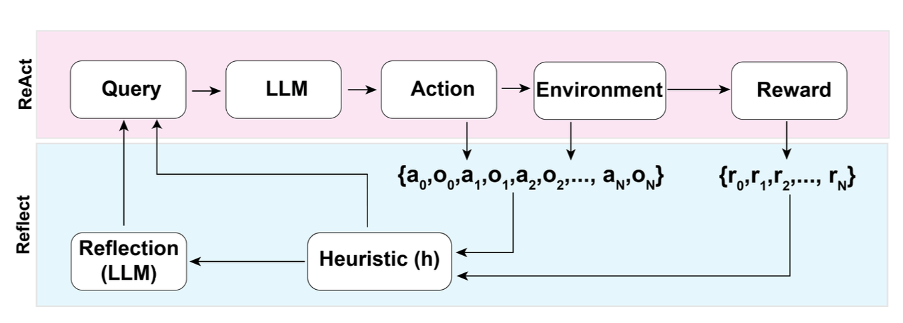
*来源:Lilian Weng 博客(原论文:Shinn et al., 2023)*

**流程**:Actor(执行) → Evaluator(打分/判断成败) → Self-Reflection(生成语言化反思:"失败是因为我没检查 X") → 存入 Episodic Memory → 下一次尝试时作为上下文。

**例子**(编程任务,HumanEval):
- 第 1 轮:生成的代码没通过测试用例 `[3,5]`。
- 反思:"我没有处理空数组的边界情况,且排序方向反了。"
- 第 2 轮:带着这条反思重新生成,通过全部测试。

**与其他自我修正的关系**:Anthropic 的 Evaluator-Optimizer 是它的 workflow 化版本;Reflexion 的贡献在于**反思要写入长期记忆跨任务/跨尝试复用**,而不是当场丢掉。

**面试考点**:反思质量决定上限——如果 Evaluator 判断错误,反思会强化错误方向(俗称"自我确认偏差"),所以关键场景还是需要外部 ground truth(测试、编译器)做评估器。

---

## 6. Memory(记忆系统)


*来源:Lilian Weng 博客*

| 类型 | 机制 | 例子 |
|---|---|---|
| **短期记忆** | 对话上下文窗口 / scratchpad | ReAct 的 Thought-Observation 序列 |
| **长期记忆** | 外部存储,用时检索 | 向量库检索历史经验(Reflexion 的 episodic memory) |
| **结构化记忆** | 文件系统、数据库、知识图谱 | Claude Code 直接读写文件;MemGPT 分层管理 |

**例子**:客服 Agent 处理同一用户两次会话——第二次会话开始时,先从长期记忆库检索"该用户的历史工单和偏好"(如"该用户是 VIP、上次投诉过物流"),注入上下文,而不是从零开始问。

**工程现实**(面试加分点):
- 上下文窗口再大也会满,主流做法是**压缩摘要 + 检索式记忆**混合:近期对话保留原文,久远对话摘要成要点存库,按相关性召回。
- MemGPT 的思路:把 LLM 当操作系统,自己决定什么留在"内存"(上下文)、什么换出到"磁盘"(向量库)。

---

## 7. Multi-Agent(多智能体)

### 7.1 为什么需要多 Agent?

单 Agent 上下文塞满所有工具和历史 → 注意力稀释、工具选择错误率上升。多 Agent 本质是**关注点分离 + 上下文隔离**:每个子 agent 只带自己需要的工具和上下文。

### 7.2 HuggingGPT:经典的 LLM 当调度器

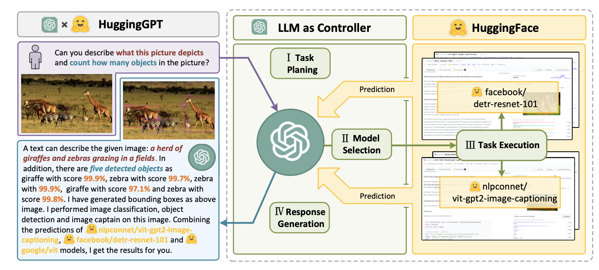
*来源:Lilian Weng 博客(原论文:Shen et al., 2023)*

LLM 作为控制器,流程:**任务规划 → 模型选择(从 HuggingFace 模型库)→ 任务执行 → 结果汇总生成回答**。这是"LLM 编排异构能力"的早期代表作。

### 7.3 Supervisor 模式(最常用)

一个主管 Agent 拆解分派,子 Agent 干活,结果回到主管汇总。

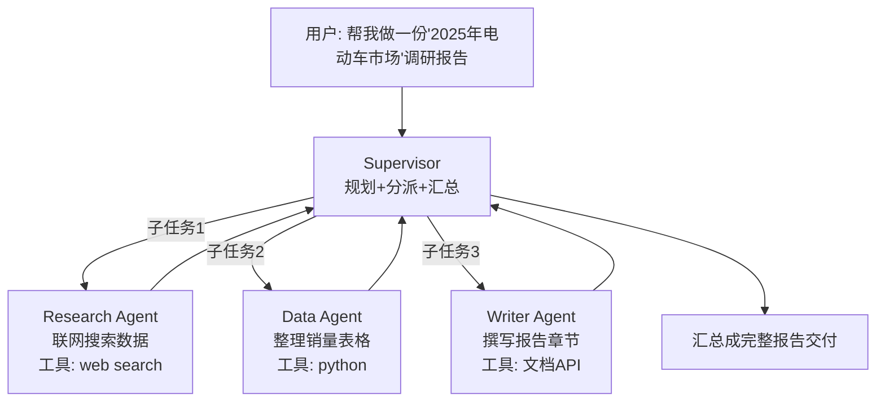

**关键设计**:子 agent 完成后**返回摘要而非完整过程**给 supervisor,控制主管的上下文膨胀(级联上下文管理)。

### 7.4 Handoff / Swarm 模式

Agent 之间**直接转移控制权**,没有中心主管。每个 agent 有自己的系统 prompt 和工具,判断"不归我管"就把对话连同历史移交出去。

**例子**(OpenAI Swarm 的经典 demo):
- 用户:"我要退款" → Triage Agent 判断 → **handoff** → Refund Agent(带订单查询+退款工具)
- 用户:"顺便问下怎么连蓝牙?" → Refund Agent 判断超范围 → **handoff** → Tech Support Agent(带知识库检索工具)

### 7.5 其他模式速览

| 模式 | 思路 | 代表 |
|---|---|---|
| Hierarchical | 多层 supervisor,树状组织 | LangGraph |
| Debate / Society of Mind | 多 agent 辩论或投票,提升结论质量 | Multi-Agent Debate、MetaGPT |
| 角色扮演流水线 | 不同角色(产品经理/工程师/QA)按软件流程协作 | MetaGPT、ChatDev |

**面试考点**(高区分度):
- Multi-Agent 何时是过度设计?→ 任务单一、工具少时,单 agent + 好的工具描述就够了。Multi-Agent 引入的代价:token 成本翻倍、调试困难、错误传播路径变长。
- Agent 间通信的信息损耗问题:子 agent 只回传摘要,主管可能缺细节;回传全量,上下文又爆。

---

## 8. MCP(Model Context Protocol)

Anthropic 推出的开放协议,目标是把"LLM 应用 ↔ 外部工具/数据源"的连接**标准化**,像 USB-C 之于外设。

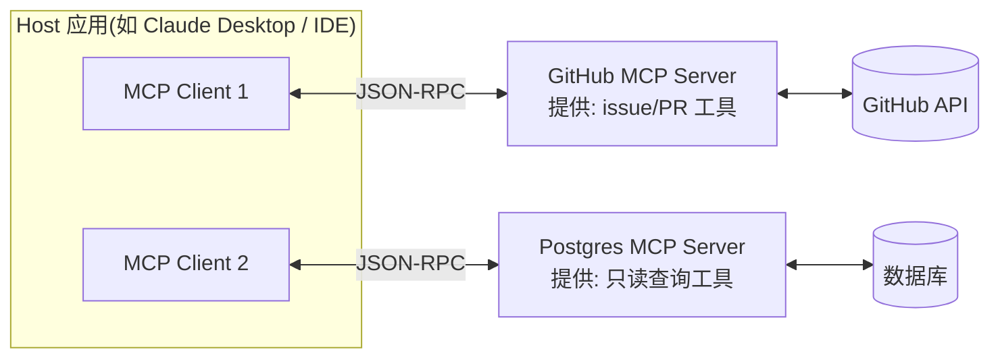

**核心概念**:
- **Host**:承载 LLM 的应用(Claude Desktop、Cursor、opencode 这类)。
- **Client**:Host 内部为每个连接起的协议客户端,1:1 绑定 server。
- **Server**:暴露三类能力——**Tools**(模型可调用的函数)、**Resources**(可读的数据)、**Prompts**(预置的 prompt 模板)。

**例子**:你正在用的这个 CLI(opencode)就是 Host——它通过 MCP 接入各种 server,LLM 想查 git log 就调 Git Server 的 tool,想查数据库就调 Postgres Server 的 tool,而 Host 代码里不需要为每个外部系统写集成逻辑。

**解决什么问题**:M×N 问题——M 个 AI 应用 × N 个工具,以前每个应用都要为每个工具写适配器(M×N 份),有了协议后双方各自实现一次即可(M+N 份)。2025-2026 年已成为事实标准,OpenAI、Google 等也宣布支持。

**面试考点**:MCP 和 Function Calling 的关系?→ Function Calling 是模型层能力(输出调用意图),MCP 是应用层协议(工具的发现、描述、调用的标准化传输),前者是后者的基础。

---

## 9. 框架对比与选型

| 框架 | 定位 | 特点 | 适合 |
|---|---|---|---|
| **LangChain / LangGraph** | 全家桶 / 图状态机 | LangGraph 用显式图+状态管理编排,可控性强,生产采用多 | 需要精细控制流程的复杂系统 |
| **AutoGen (Microsoft)** | 对话式多 Agent | Agent 之间以对话协作,支持人工介入 | 研究、多 agent 对话型任务 |
| **CrewAI** | 角色化多 Agent | "Crew(团队)+ Role(角色)+ Task(任务)"抽象,上手快 | 快速搭建角色分工的团队 |
| **OpenAI Agents SDK** | 轻量官方 SDK | Agents + handoffs + guardrails,极简 | OpenAI 生态内的轻量场景 |
| **Claude Agent SDK** | Anthropic 官方 | 子 agent、工具、权限管理一体化 | Claude 生态 |
| **手写编排** | 直接调 API | 一个 while 循环 + tool use,零抽象 | Anthropic 明确推荐:先手写,别急着上框架 |

**选型判断**(面试送分题,答好是亮点):
1. 任务固定 → workflow(甚至不用框架)
2. 任务开放、步数不可预测 → agent 循环
3. 需要多角色/多工具隔离 → multi-agent
4. **先问能不能不用 agent**——单次 LLM 调用 + 好的检索 + few-shot 往往就够(Anthropic 原话)

---

# 第二部分:RAG 召回思路

## 0. 基础管线与范式演进

**Naive RAG 管线**:离线(解析 → 切块 → 向量化 → 入库) + 在线(query 向量化 → ANN 近似检索 top-k → 拼 prompt → 生成)。

Gao et al. 的综述把 RAG 分为三代:

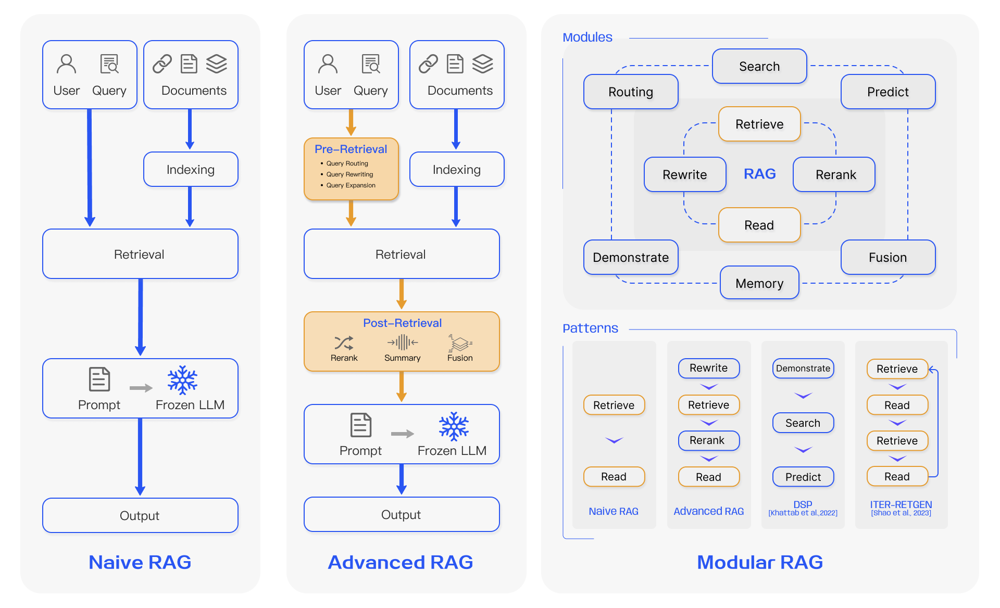
*来源:[Retrieval-Augmented Generation for Large Language Models: A Survey](https://arxiv.org/abs/2312.10997)(Gao et al., 2023)*

| 范式 | 思路 |
|---|---|
| **Naive RAG** | 简单的"检索-拼接-生成" |
| **Advanced RAG** | 在检索**前**(query 改写)和检索**后**(rerank)做优化 |
| **Modular RAG** | 组件化编排,检索可迭代、可路由、多轮,与 Agent 合流 |

**召回的本质矛盾**(全文的主线):①query 和 document 的**语义鸿沟**(用户问法和文档写法不一致);②**召回粒度与上下文完整性的权衡**(块小了检索准但信息碎,块大了信息全但检索糊)。下面所有技术都是在解这两个问题。

**先看一个混合检索的标准架构**(Anthropic 的图,也是生产标配):

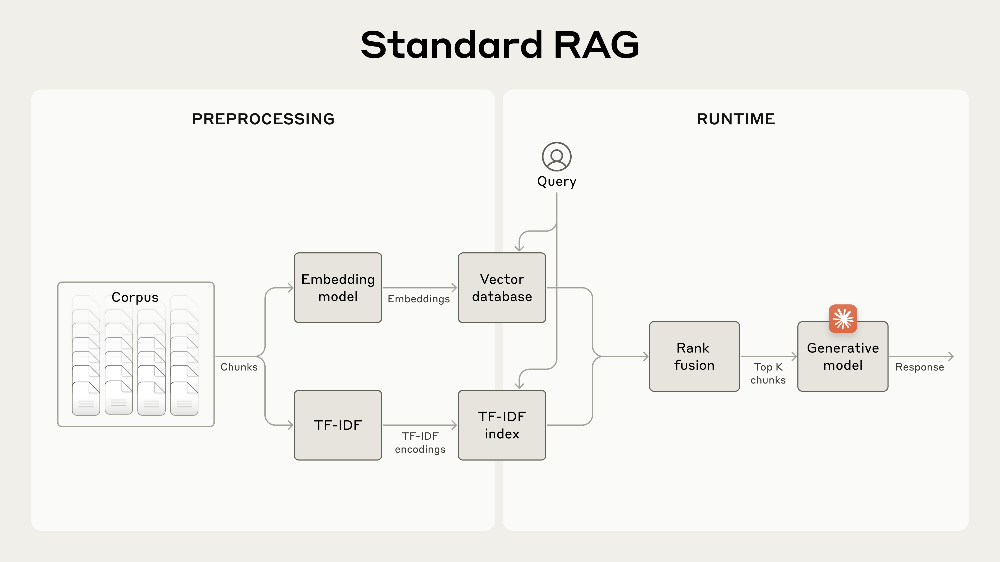
*来源:[Anthropic - Contextual Retrieval](https://www.anthropic.com/news/contextual-retrieval)*

---

## 1. 多路召回:Dense + Sparse + RRF 融合

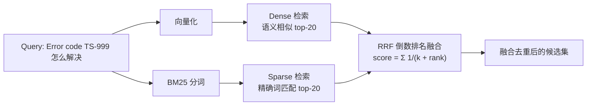

| 通道 | 强项 | 弱项 |
|---|---|---|
| **Dense(向量)** | 语义泛化:"怎么退货" 能匹配 "退换货流程" | 专有名词、错误码、型号等精确 token 弱 |
| **Sparse(BM25)** | 精确匹配:"TS-999" 这种错误码一击必中 | 同义词、改写无能为力 |
| **Hybrid + RRF** | 互补 | 融合参数 k 需要调 |

**例子**(Anthropic 原例):用户查 "Error code TS-999",embedding 检索会召回一堆"常见错误码"的泛泛文档,**漏掉真正写了 TS-999 的那一篇**;BM25 则直接命中。反之用户问"怎么退货"而文档写的是"退换货流程",BM25 抓瞎,向量能对上。所以生产中基本默认开 hybrid。

**RRF(Reciprocal Rank Fusion)**:不需要调分数权重,只看排名——`score(d) = Σ 1/(k + rank_i(d))`,k 通常取 60。简单、稳健、免调参,所以成了默认选择。

**面试考点**:为什么用 RRF 而不是加权分数融合?→ 向量相似度和 BM25 分数量纲不同,加权融合要调权重且对 score 分布敏感;RRF 只用排名,鲁棒。

---

## 2. Query 侧改造(检索前优化)

### 2.1 Query Rewrite / Expansion

让 LLM 先把口语化、上下文依赖的 query 改写成适合检索的独立 query,或扩展同义表述。

**例子**:对话中用户问"那它支持吗?"(指上一轮的数据库)→ 直接拿去检索必然失败 → 改写成 "PostgreSQL 15 是否支持向量索引"。

### 2.2 HyDE(Hypothetical Document Embeddings)

**思路**:**答案和文档之间的相似度,高于问题和文档之间的相似度**。所以让 LLM 先"编"一个假想答案,拿假想答案的向量去检索真文档。

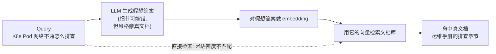

**例子**:query "K8s Pod 网络不通怎么排查" → LLM 生成一段假想答案(可能技术细节是错的,但**语言风格、术语密度、结构**像真文档)→ 用它检索,命中运维手册里 "Pod 网络排查" 章节的概率大增。

**什么时候失效**(面试高区分度):知识库文档写法很特殊(LLM 生成的"假想文档"风格对不上)、多语言场景(query 和文档语言不一致)、或 LLM 对该领域完全陌生(编出来的答案偏离太远)。

### 2.3 Query Decomposition(拆解)

复杂问题拆成子查询分别检索。

**例子**:"对比 A 公司和 B 公司 2024 年的毛利率" → 拆成 "A公司2024毛利率" + "B公司2024毛利率" 两次检索 → 各自召回后再合并给 LLM 对比。单次检索很难同时命中两家的财报段落。

### 2.4 Step-back(退后提问)

先抽象出更泛的问题,检索背景知识,再答具体问题。

**例子**:"清华姚班 2019 级的张三拿了什么奖?" → step-back 问题 "清华姚班是什么、它的学生通常拿哪些奖" → 检索到背景 → 结合背景回答具体问题。

### 2.5 Self-Query(元数据抽取)

LLM 从自然语言 query 中抽取**语义部分 + 结构化过滤条件**。

**例子**:"2023 年之后张三发表的关于 RAG 的论文" → 语义向量:"RAG 相关论文",过滤器:`author = "张三" AND year > 2023`。向量库做相似搜索,过滤器在元数据上执行,两者结合。

---

## 3. 文档/索引侧改造

### 3.1 Chunking(切块)策略

| 策略 | 思路 | 适用 |
|---|---|---|
| 固定长度 | 按 token 数切,带 overlap | 快糙猛的基线 |
| 递归切分 | 先按段落,太长再按句子 | 通用默认 |
| 结构切分 | 按标题/章节/Markdown 层级 | 文档结构良好的场景 |
| 语义切分 | embedding 判断句子间语义断点 | 质量要求高时 |

chunk 大小是"检索精度 vs 上下文完整性"的直接权衡,典型值 256~1024 token。

### 3.2 Small-to-Big(父子块)——高频考点

**小块做召回,大块喂模型**,解耦"检索单元"和"生成单元":

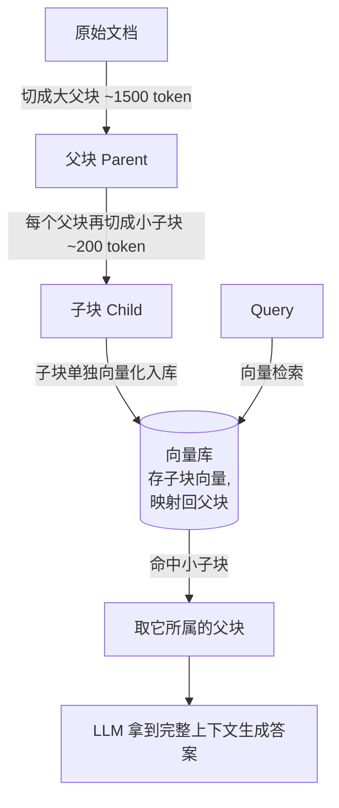

**例子**:员工手册里"年假"的完整政策在一段 1500 字的章节里。200 字的子块 "年假可跨年结转至次年 3 月" 能被 "年假能攒到明年吗" 精准命中,但只有这句不足以回答所有细节——于是把它所属的整章(父块)给 LLM,上下文完整,答案不片面。

### 3.3 多表示索引 / 假设问题

为每个 chunk 用 LLM 生成"**这个块能回答什么问题**",用这些问题(而非原文)做向量化。用户 query 天然是"问题",和"假设问题"同分布,检索更准。

### 3.4 RAPTOR:递归摘要树

对 chunks 聚类 → 摘要 → 对摘要再聚类 → 再摘要,形成多层树。底层保留细节,高层保留全局语义;查询时按需选层。

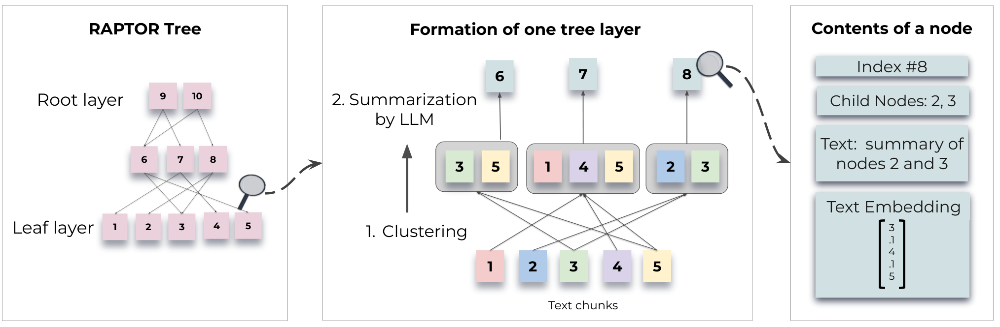
*来源:[RAPTOR: Recursive Abstractive Processing for Tree-Organized Retrieval](https://arxiv.org/abs/2401.18059)(Sarthi et al., 2024)*

**解决什么**:普通 RAG 只能召回局部细节,回答不了"这本文档的整体主题是什么"这类**全局问题**——摘要层就是为它准备的。

### 3.5 GraphRAG(微软)

把语料抽取成**知识图谱**,再做社区检测,生成社区摘要。检索分两种模式:

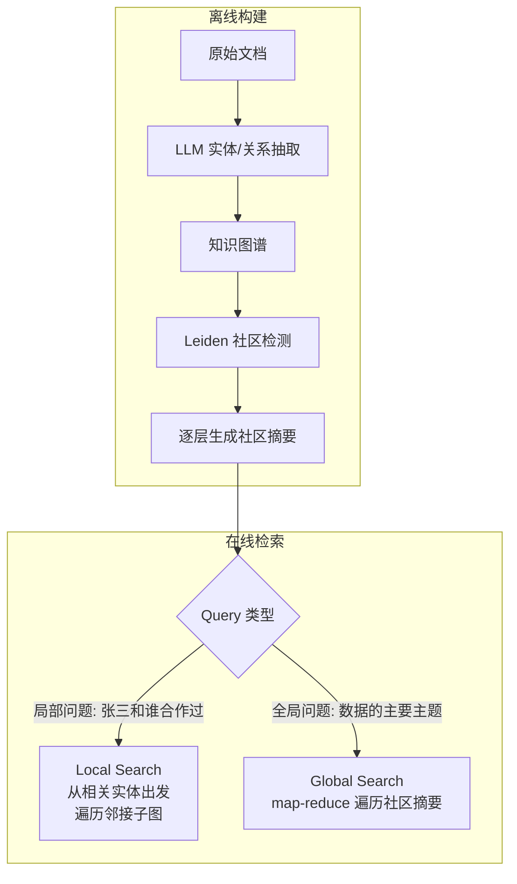

**例子**:"这批客服工单里,客户不满的主要原因有哪些?" —— 这种全局归纳问题,向量检索只能召回若干零散工单,GraphRAG 遍历"产品问题/物流问题/服务态度"各社区的摘要,直接给出结构化归纳。

**代价**(面试要点):实体抽取要过一遍 LLM,构建成本高;图谱质量依赖抽取质量;更新文档需要增量维护图。**适合一次性构建、多次查询的全局分析场景**,不适合频繁更新的业务数据。

### 3.6 Contextual Retrieval(Anthropic)

传统切块的痛点:**chunk 脱离了文档上下文,embedding 缺乏指代信息**。

Anthropic 的例子:SEC 财报切块后有一段 "The company's revenue grew by 3% over the previous quarter"——**这段根本没说是哪家公司、哪个季度**,检索时必然召回不准。

解法:入库前,让 LLM 为每个 chunk 生成一段 50~100 token 的上下文前缀,再进行 embedding 和 BM25 索引:

```
原始 chunk:  "The company's revenue grew by 3% over the previous quarter."

上下文化后:  "本段出自 ACME 公司 2023 年 Q2 的 SEC 财报;上季度营收 3.14 亿美元。
             The company's revenue grew by 3% over the previous quarter."
```


*来源:[Anthropic - Introducing Contextual Retrieval](https://www.anthropic.com/news/contextual-retrieval)*

**效果数字**(面试可引用):top-20 检索失败率 5.7% → 3.7%(Contextual Embeddings,-35%)→ 2.9%(+ Contextual BM25,-49%)→ **1.9%(+ Rerank,-67%)**。借助 prompt caching,上下文化成本约 **$1.02 / 百万文档 token**。

---

## 4. Rerank(两阶段检索:粗排 + 精排)

**为什么需要**:粗排(向量/BM25)是双塔结构,query 和 doc 独立编码,为了 ANN 加速牺牲了交互;cross-encoder 把 (query, doc) **拼在一起**过模型,精度高一档,但每个候选都要跑一遍,不可能全库扫。

**所以两阶段**:粗排召回 top-50~150 → cross-encoder 精排 → top-5~20 进 prompt。


*来源:Anthropic - Contextual Retrieval(Anthropic 实验用 Cohere Rerank,取 top-150 精排到 top-20)*

**常用 reranker**:Cohere Rerank、BGE-reranker(开源)、Voyage Rerank、LLM-as-reranker(让 LLM 对每个候选打分,贵但零部署)。

**面试考点**:为什么不直接用 cross-encoder 做检索?→ 全库逐对打分是 O(N) 次前向,线上算不动;ANN 粗排是亚秒级,所以工业界永远是"低成本召回 + 高成本精排"两级漏斗。

---

## 5. Agentic RAG(与 Agent 合流)

### 5.1 Self-RAG:按需检索 + 自我批判

训练模型输出**反思 token**:该不该检索(ISRET)、检回的相关吗(ISREL)、答案有依据吗(ISSUP)、有用吗(ISUSE)。推理时模型自己决定何时检索、并对检索质量和自己的答案自评,不相关就丢弃重检。

**例子**:问"今天天气怎么样"——模型判断无需外部知识,直接答;问"Q3 营收"——先检索,检回一段无关的 HR 文档,ISREL 判定"不相关",丢弃重新组织检索。

### 5.2 CRAG(Corrective RAG):检索质量评估 + 兜底

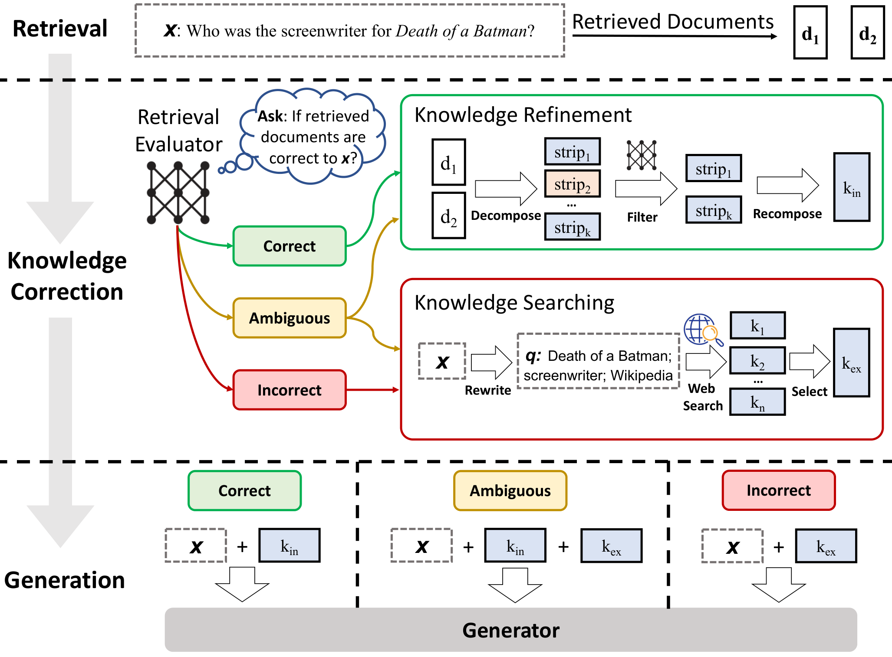
*来源:[Corrective Retrieval Augmented Generation](https://arxiv.org/abs/2401.15884)(Yan et al., 2024)*

轻量级 retrieval evaluator 给检索结果打分,分三档行动:
- **Correct** → 精炼(去噪)后直接用
- **Incorrect** → **丢弃,转 web search 兜底**再融合
- **Ambiguous** → 两者结合

**例子**:企业知识库没覆盖的产品问题,向量检索硬是召回了几段不相关的内部文档 → evaluator 判 Incorrect → 转外部搜索拿到正确资料。这就是"知道检索不行,就换路子"的 agent 思维。

### 5.3 Agentic RAG 总体形态

把检索变成 agent 的一个**决策动作**:查不查、查什么、查几个源、查几轮、结果够不够好。

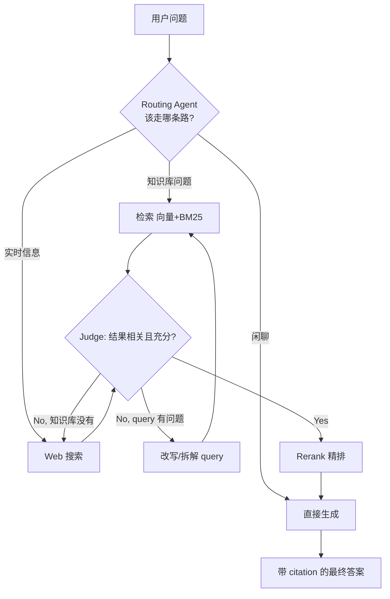

**例子**(面试可以讲得很具体):用户问"我们公司 2024 年报里的营收和行业平均水平比怎么样?"——
1. Router 判断需要两路信息:内部(年报)+ 外部(行业数据)
2. 拆成两个子 query 分别检索
3. 内部路命中,外部路第一次检索结果太旧 → judge 触发改写加 "2024" 重新检索
4. 两路结果 rerank 后合并生成,citation 分别指向年报第 X 页和行业报告链接

---

## 6. 评估体系(区分候选人水平的关键)

**分层评估原则:先评召回,再评端到端。** 否则效果差时无法定位是检索的锅还是生成的锅。

| 层 | 指标 | 说明 |
|---|---|---|
| 检索层 | **Recall@k** | 前 k 个结果包含正确文档的比例(最重要) |
| 检索层 | **MRR** | 第一个相关文档排名的倒数的均值 |
| 检索层 | **nDCG** | 带位置折损的排序质量 |
| 生成层 | **Faithfulness(忠实度)** | 答案是否严格基于检索内容(反幻觉) |
| 生成层 | **Answer Relevancy** | 答案是否切题 |
| 生成层 | **Context Precision/Recall** | 检索上下文的精确率/召回率 |

常用工具:**RAGAS**(自动化评估 faithfulness 等,用 LLM 当裁判)、自建 golden set(人工标注 query→正确 chunk 对)。

**诊断流程**(面试加分项):
1. 答案错 → 先看检索到的 chunk 对不对
2. chunk 对但答案错 → 生成问题(换模型/改 prompt/加 citation 约束)
3. chunk 不对 → 检索问题,继续拆:query 改写有没有做?chunking 合不合理?embedding 模型选型?加 rerank 有没有提升?
4. 每次优化都要在固定 golden set 上跑指标,不能凭感觉

---

## 7. RAG 技术全景图

Gao et al. 综述的技术树,面试前扫一遍可以查漏补缺:


*来源:Retrieval-Augmented Generation Survey(Gao et al., 2023)*

---

## 8. 常见坑

| 坑 | 现象 | 解法 |
|---|---|---|
| **Lost in the Middle** | 长上下文中间位置的信息被忽略 | rerank 后把最相关的放头尾 |
| 检索质量差但没人发现 | 端到端指标差,互相甩锅 | 分层评估,先修召回 |
| 幻觉 | 检索没有也硬答 | 强制 citation、faithfulness 评估、拒答机制 |
| PDF 表格/图片 | 解析成乱码,检索全废 | 换好解析器(表格转 Markdown/HTML)、多模态 embedding |
| 冷启动的 golden set 缺失 | 无法量化优化效果 | 先人工标 50~100 条,持续从 bad case 积累 |
| 语义缓存缺失 | 重复 query 重复算 | 相同/相似 query 直接返回缓存 |

---

# 附录

## 高区分度面试题(附考察点)

1. **HyDE 为什么有效?什么场景失效?** → 考对"检索本质是相似度匹配"的理解,而非背流程。
2. **为什么需要 rerank?为什么不直接用 cross-encoder 检索?** → 考两阶段检索的效率/效果权衡。
3. **什么情况下你不会用 Agent 而用 workflow?** → 考工程判断(Anthropic:任务固定、可预测就用 workflow,agent 用延迟和成本换灵活性)。
4. **RAG 效果差,怎么定位是召回问题还是生成问题?** → 考分层评估思路(golden set + Recall@k + faithfulness)。
5. **ReAct 和 Plan-and-Execute 各自的适用场景?** → 考单步规划 vs 全局规划的取舍。
6. **Multi-Agent 什么时候是过度设计?** → 考成本意识(token 翻倍、调试复杂、错误传播)。
7. **Contextual Retrieval 解决什么问题?为什么便宜?** → 考对 chunk 上下文丢失的理解 + prompt caching 成本意识。
8. **GraphRAG 和普通 RAG 的本质区别?什么时候值得上?** → 考对"全局问题 vs 局部问题"的理解。

## 图片与参考资料来源

| 本地图 | 来源 |
|---|---|
| `agent-overview.png`, `lilianweng-reflexion.png`, `lilianweng-memory.png`, `lilianweng-hugginggpt.png` | [Lilian Weng - LLM Powered Autonomous Agents](https://lilianweng.github.io/posts/2023-06-23-agent/) |
| `anthropic-*.png` (8 张 workflow/agent 图, standard-rag, reranking), `contextual-retrieval-flow.png` | [Anthropic - Building Effective Agents](https://www.anthropic.com/research/building-effective-agents) / [Contextual Retrieval](https://www.anthropic.com/news/contextual-retrieval) |
| `react-diagram.png` | [ReAct: Synergizing Reasoning and Acting in Language Models](https://react-lm.github.io/)(Yao et al., ICLR 2023) |
| `rag-survey-framework.png`, `rag-survey-tech-tree.png` | [RAG for LLMs: A Survey](https://arxiv.org/abs/2312.10997)(Gao et al., 2023) |
| `crag-method.png` | [Corrective Retrieval Augmented Generation](https://arxiv.org/abs/2401.15884)(Yan et al., 2024) |
| `raptor-tree.png` | [RAPTOR](https://arxiv.org/abs/2401.18059)(Sarthi et al., 2024) |
| HyDE / Self-RAG / Plan-and-Execute / MCP 等 Mermaid 图 | 依据 [HyDE](https://arxiv.org/abs/2212.10496)、[Self-RAG](https://arxiv.org/abs/2310.11511)、[MCP 文档](https://modelcontextprotocol.io/)、LangChain/LangGraph 文档自绘 |

*其他推荐阅读:[GraphRAG(微软)](https://microsoft.github.io/graphrag/)、[LangGraph Multi-agent 文档](https://langchain-ai.github.io/langgraph/concepts/multi_agent/)、[RAGAS 文档](https://docs.ragas.io/)*
